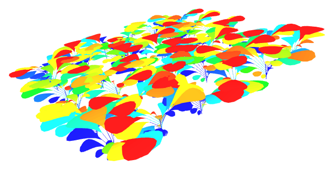

# Welcome to Colzette's documentation

<figure>
    
    <figcaption>Heat map representation of the surfacic density of energy absorbed by an monocrop of Rapessed plants.</figcaption>
</figure>

OpenAlea.Colzette is a Parametric Model for oilseed rape and legume.

```{toctree}
:maxdepth: 1
:caption: Contents:

Install <installation>
notebook_examples.rst
API Reference <api>
More <extra>
```
